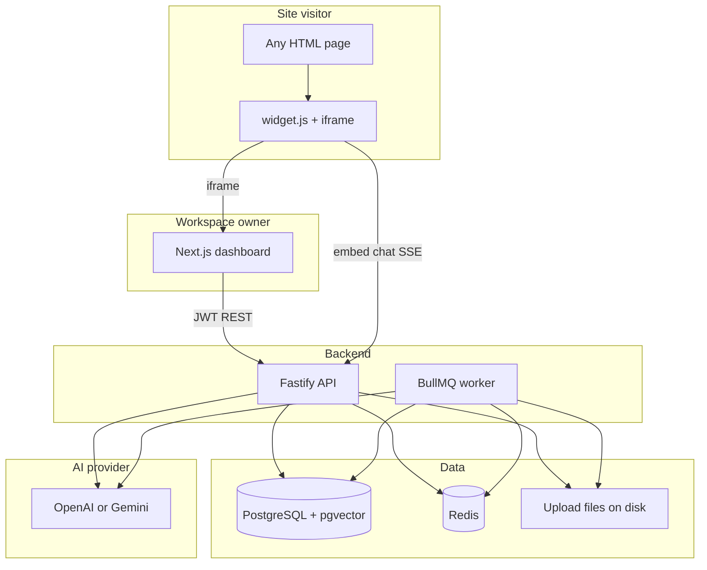
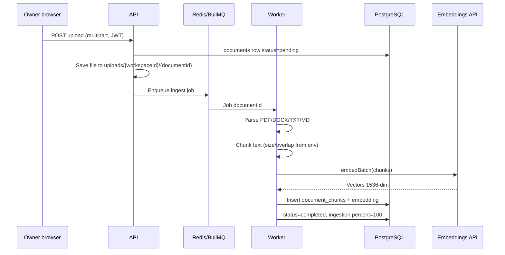
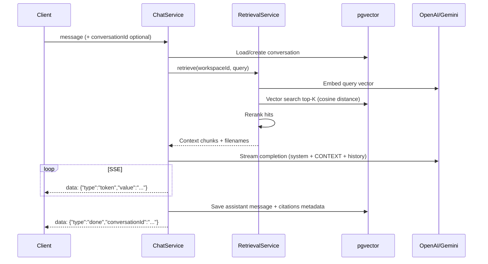

# How this project works

This document explains the **RAG Agent Platform** end to end: what runs where, how data flows, and how the embeddable website chat fits in.

For setup commands, see [README.md](./README.md). For end-user and admin guides, see [docs/USER.md](./docs/USER.md) and [docs/ADMIN.md](./docs/ADMIN.md). For module/file layout aimed at contributors, see [AGENTS.md](./AGENTS.md).

---

## What you are building

A **multi-tenant RAG (Retrieval-Augmented Generation) SaaS**:

1. You **sign up** and create a **workspace** (one customer / one knowledge base).
2. You **upload documents** (PDF, DOCX, TXT, MD) — e.g. your website content as a PDF.
3. The system **chunks and embeds** them into PostgreSQL (**pgvector**).
4. You copy an **embed script** (like Zendesk) onto any HTML site.
5. **Visitors** on that site open the chat widget; answers are generated **only from that workspace’s documents**, scoped by **workspace ID + embed key**.

Each workspace is isolated: different PDFs, different embed key, different visitor conversations.

---

## What runs locally

| Process | Command | Port | Role |
|--------|---------|------|------|
| **PostgreSQL** (+ pgvector) | `docker compose up -d postgres` | 5432 | Users, workspaces, documents, chunks, vectors, conversations |
| **Redis** | `docker compose up -d redis` | 6379 | BullMQ queue for async ingestion jobs |
| **API** | `npm run dev -w @rag/api` | 4000 | REST + SSE + embed script + uploads |
| **Worker** | `npm run worker` | — | Parses files, embeds chunks, updates document status |
| **Web** | `npm run dev -w @rag/web` | 3000 | Dashboard (login, upload, embed snippet) |

The **worker must be running** after upload, or documents stay at `queued · 0%`.

---

## High-level architecture



---

## Repository layout

```
rag-agent/
├── apps/api/          # Fastify API + ingestion worker entry
├── apps/web/          # Next.js dashboard + /embed chat UI
├── demo-site/         # Sample HTML page with embed script
├── docker-compose.yml
├── .env               # Secrets (not in git)
└── package.json       # npm workspaces root
```

**Pattern in the API:** HTTP route → **service** → **repository** (Drizzle ORM). Inputs validated with **Zod**.

---

## Two ways to use chat

### 1. Dashboard (authenticated)

Used by the workspace **owner** to manage content:

- Sign up / log in → JWT access + refresh tokens.
- Create workspace → upload files → copy **embed snippet** from the workspace page.
- Internal dashboard chat was replaced by the **embed-first** flow; testing uses **Preview widget** or `demo-site/`.

### 2. Embeddable widget (public, key-scoped)

Used by **visitors** on external sites:

1. **Script** loads from the API: `GET /v1/embed/widget.js`
2. Script reads `data-workspace-id` and `data-embed-key`, injects a **Chat** button and **iframe** pointing to `http://localhost:3000/embed/{workspaceId}?key=...`
3. The iframe page calls **`POST /v1/embed/chat/stream`** (no login; embed key proves access).
4. Each browser gets a **`visitorId`** in `localStorage`; conversations are stored with `visitor_id` so history persists per visitor.
5. History loads via **`GET /v1/embed/conversations/:id/messages`**.

**Security model:** Knowing `workspaceId` alone is not enough; the **embed key** must match the row in `workspaces.embed_public_key`. Rotate keys from the dashboard if leaked.

---

## Document ingestion (upload → searchable)



**Statuses:** `pending` → `processing` → `completed` or `failed`. The dashboard polls the document list every few seconds to show progress.

**Supported types:** PDF (`pdf-parse`), DOCX (`mammoth`), plain text and Markdown.

---

## RAG chat (question → answer)

When someone sends a message (dashboard SSE or embed SSE):



**Grounding:** The system prompt tells the model to answer **only from CONTEXT**. If nothing relevant is retrieved, it should say it could not find the answer in the documents.

**Citations:** Retrieved chunks are stored on the assistant message as `metadata.citations` (chunk id, filename, snippet).

**AI provider:** Set `AI_PROVIDER=openai` or `gemini` in `.env`. Same provider is used for **embeddings** (ingestion + retrieval) and **chat**.

---

## Data model (simplified)

| Table | Purpose |
|-------|---------|
| `users` | Accounts (email + password hash) |
| `workspaces` | Tenant; has `embed_public_key` for widget |
| `workspace_members` | User ↔ workspace + role (`owner`, `admin`, `member`) |
| `documents` | Uploaded file metadata + `status` + `ingestion` JSON |
| `document_chunks` | Text chunks + **vector(1536)** embedding + metadata |
| `conversations` | Chat thread; `user_id` (dashboard) or `visitor_id` (embed) |
| `messages` | `user` / `assistant` turns + optional citations |
| `usage_events` | Token usage logging |

**Isolation:** Retrieval always filters by `workspace_id`. Embed routes also verify `embed_public_key`.

---

## Authentication

| Audience | Mechanism |
|----------|-----------|
| Dashboard | **JWT** bearer token (`Authorization` header), refresh via `/v1/auth/refresh` |
| Embed widget | **embed key** + `workspaceId` + `visitorId` in request body/query |

---

## Important environment variables

| Variable | Purpose |
|----------|---------|
| `DATABASE_URL` | PostgreSQL connection |
| `REDIS_URL` | BullMQ |
| `JWT_ACCESS_SECRET` / `JWT_REFRESH_SECRET` | Auth (min 32 chars) |
| `AI_PROVIDER` | `openai` or `gemini` |
| `OPENAI_API_KEY` / `GEMINI_API_KEY` | LLM + embeddings |
| `GEMINI_CHAT_MODEL` | e.g. `gemini-2.5-flash` |
| `EMBEDDING_DIMENSIONS` | Must match DB vector column (1536) |
| `UPLOAD_DIR` | Where raw files are stored |
| `CORS_ORIGIN` | Allowed browser origins for API |
| `EMBED_WIDGET_ORIGIN` | Base URL for iframe (`http://localhost:3000`) |
| `PUBLIC_API_URL` | Base URL in generated embed snippet |
| `NEXT_PUBLIC_API_URL` | Web app → API calls |

Copy from [`.env.example`](./.env.example); never commit `.env`.

---

## Key API routes

| Route | Who | What |
|-------|-----|------|
| `POST /v1/auth/signup` | Public | Create account |
| `POST /v1/workspaces` | User | Create workspace |
| `POST /v1/workspaces/:id/documents/upload` | Member | Upload file |
| `GET /v1/workspaces/:id/embed` | Member | Get embed script + keys |
| `GET /v1/embed/widget.js` | Public | Loader script |
| `POST /v1/embed/chat/stream` | Public (embed key) | Visitor chat SSE |
| `GET /v1/embed/conversations/:id/messages` | Public (embed key) | Visitor chat history |
| `POST /v1/workspaces/:id/chat/stream` | Member | Dashboard chat SSE (if used) |

OpenAPI UI (dev): `http://localhost:4000/docs`

---

## Where to read the code

| Topic | Location |
|-------|----------|
| Env / AI provider | `apps/api/src/config/env.ts` |
| HTTP app bootstrap | `apps/api/src/http/app.ts` |
| Embed routes + widget.js | `apps/api/src/http/routes/v1/embed.routes.ts` |
| Chat + streaming | `apps/api/src/modules/chat/chat.service.ts` |
| Vector search | `apps/api/src/modules/documents/document.repository.ts` |
| Retrieval | `apps/api/src/modules/retrieval/retrieval.service.ts` |
| Ingestion job | `apps/api/src/modules/ingestion/ingestion.processor.ts` |
| Worker entry | `apps/api/src/worker.ts` |
| Dashboard workspace UI | `apps/web/src/app/w/[workspaceId]/page.tsx` |
| Embed chat UI | `apps/web/src/app/embed/[workspaceId]/page.tsx` |
| DB schema | `apps/api/src/infra/db/schema.ts` |

---

## Typical day-one flow

1. Start Postgres, Redis, API, worker, web (see README checklist).
2. Open `http://localhost:3000` → sign up → create workspace.
3. Upload a PDF; wait until status is **completed** (worker running).
4. Copy **embed snippet** from the workspace page.
5. Paste into `demo-site/index.html` or your site. For the sample page, from repo root: `npx --yes serve demo-site -p 8080` → http://localhost:8080 (not `file://`).
6. Click **Chat**, ask a question; answers should cite your document content.

---

## CI

GitHub Actions (`.github/workflows/ci.yml`) runs install, lint, and tests on push/PR. It does not start Postgres/Redis by default unless extended.
